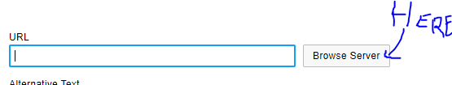

login: admin@admin.fr
mdp: admin

0. faire un host
1. composer install
2. php bin/console d:d:c
3. php bin/console d:m:mig
4. php bin/console d:f:l
5. php bin/console ckeditor:install
6. php bin/console assets:install
7. php bin/console elfinder:install

L'utilisateur est déconnecter lorsque je clique 